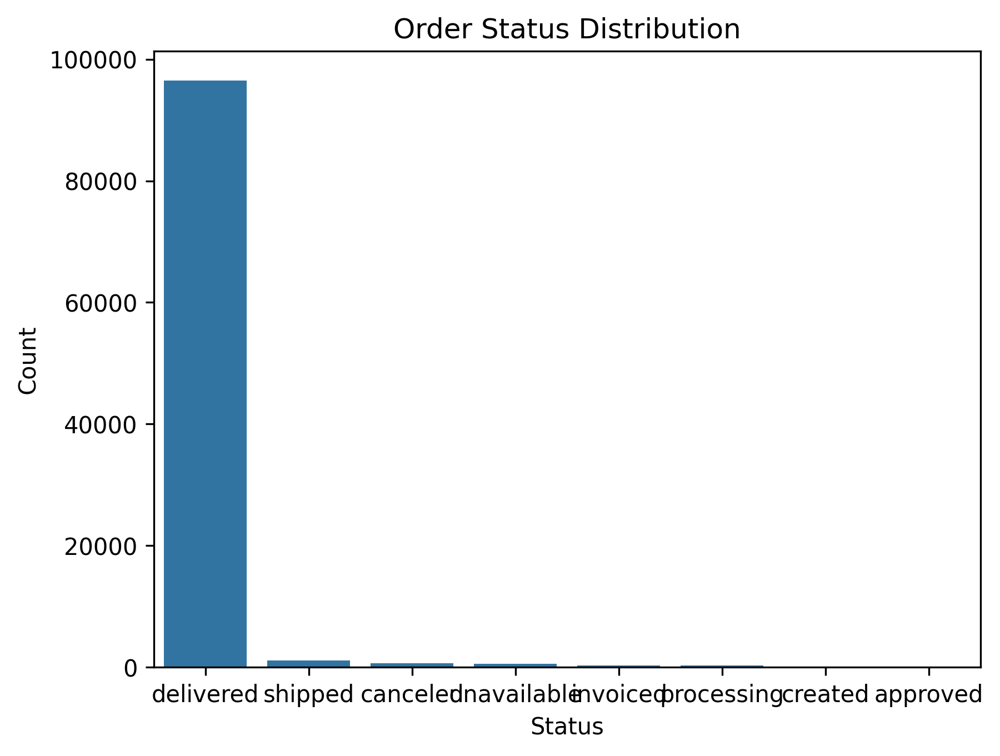
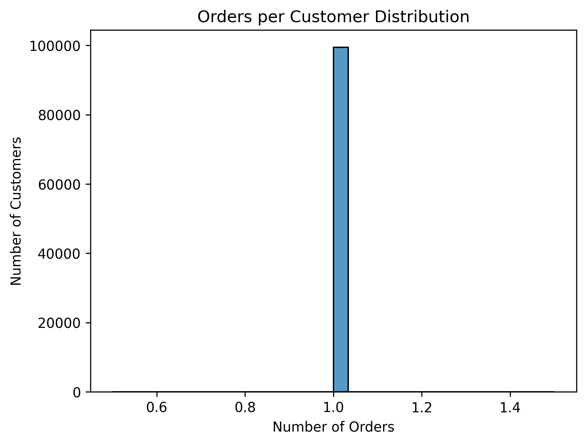
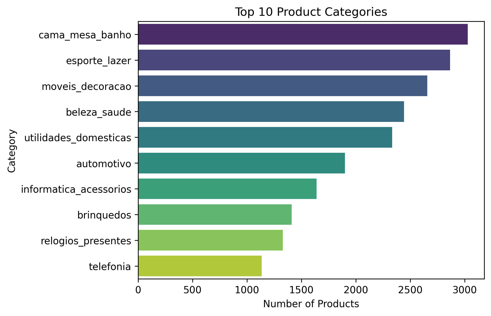
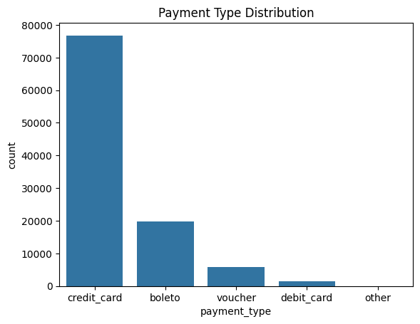
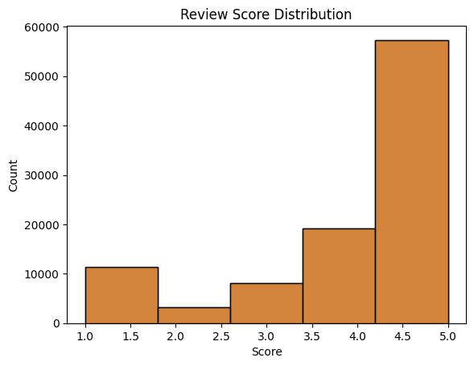
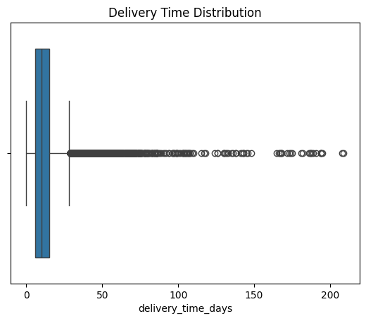

# End-to-End Data Analytics Project: Kaggle E‑commerce Orders → Power BI Dashboards

## 📌 Overview
This project demonstrates my expertise in **data analytics and business intelligence** by building a complete pipeline:
- **Data Source:** Kaggle E‑commerce Orders dataset (customers, sellers, orders, delivery times, revenue).

## 🐍 Python & 🗄️ SQL Work

### Python Wrangling
- Imported raw Kaggle CSVs into Jupyter Notebook.
- Cleaned missing values and standardized delivery times.
- Normalized columns for consistency (e.g., date formats).
- Staged cleaned data for SQL schema loading.

### SQL Schema Design
- Designed **fact and dimension tables**:
  - Fact: Orders
  - Dimensions: Customers, Sellers, Date
- Enforced relationships with primary/foreign keys.
- Wrote staging queries to load cleaned data into schema.

### Validation
- Ran SQL checks for:
  - Duplicate IDs
  - Missing dates
  - Consistency between fact and dimension tables
- Ensured schema integrity before connecting to Power BI.

- **Power BI Dashboards:** Delivered a 3‑page interactive report for executives and operations.

## 📊 Exploratory Data Analysis (EDA)

After completing data wrangling and staging the cleaned tables, we performed Exploratory Data Analysis (EDA) in Python to better understand the Kaggle E‑commerce dataset.  
This section highlights key insights using Python-generated visuals.

---

### 1. Orders
  
*Most orders are delivered successfully, with a smaller share canceled or still processing.*

---

### 2. Customers
  
*Most customers place only one order, but a few repeat buyers drive higher volumes.*

---

### 3. Products
  
*Electronics and home goods dominate the product categories.*

---

### 4. Payments
  
*Credit card is the most common payment method, followed by boleto and others.*

---

### 5. Reviews
  
*Most customers give 4–5 star ratings, but there’s a noticeable share of low scores.*

---

### 6. Delivery Times
  
*Most deliveries are completed within a week, but some outliers take much longer.*

---

### ✅ EDA Summary
- Most orders are delivered successfully.  
- Credit card dominates payments.  
- Electronics and home goods are top-selling categories.  
- Reviews skew positive, but low scores highlight service issues.  
- Delivery times are usually within a week, with some delays.  

These insights validated the wrangling process and formed the foundation for building interactive dashboards in Power BI.

---

## 🟩 Skills Demonstrated
- **Python:** Data wrangling, staging, cleaning.
- **SQL:** Schema design, staging queries, validation checks.
- **Data Modeling:** Fact/dimension schema, relationships.
- **Power BI & DAX:** MoM growth %, rolling 12‑month measures, KPI cards, trend analysis.
- **Dashboard Design:** Executive storytelling, operational monitoring, anomaly detection, data quality validation.

---

## 🟦 Business Problems Solved

- **Executive Visibility**  
  *Problem:* Leaders lacked a clear view of revenue, orders, customers, and sellers.  
  *Solution:* Built an **Executive Dashboard** with MoM growth %, KPI cards, and rolling 12‑month trends to give decision‑makers instant visibility into business performance.

- **Operational Efficiency**  
  *Problem:* Delivery delays were hidden in raw data, making it hard to track service quality.  
  *Solution:* Designed a **Delivery Performance Dashboard** to monitor late deliveries, average delivery times, and on‑time delivery rates, enabling proactive improvements.

- **Risk & Anomaly Detection**  
  *Problem:* Outliers (customers, sellers, or orders behaving unusually) distorted reporting and could signal fraud or inefficiency.  
  *Solution:* Built an **Outlier Detection Dashboard** with Histogram and box plots to highlight anomalies for deeper investigation.

- **Data Quality & Trust**  
  *Problem:* Inconsistent or missing dates undermined reporting accuracy.  
  *Solution:* Created a **Date Validation Page** to ensure a continuous calendar and reliable metrics, strengthening trust in the dashboards.

---

## 🟦 Project Structure
📂 ecommerce-analytics-project
│
├── 📄 README.md
├── 📂 data
│   └── kaggle_dataset.csv
├── 📂 notebooks
│   └── wrangling.ipynb
├── 📂 sql
│   ├── schema_design.sql
│   ├── staging_queries.sql
│   └── validation_checks.sql
├── 📂 powerbi
│   └── dashboards.pbix
├── 📂 docs
│   ├── executive_dashboard.md
│   ├── delivery_performance.md
│   ├── outlier_detection.md
│   └── date_validation.md
└── 📂 images
├── executive_dashboard.png
├── delivery_performance.png
├── outlier_detection.png
└── date_validation.png

---

## 🟩 Dashboard Pages
- **Executive Dashboard** → MoM growth % cards, KPI counts, late deliveries, rolling 12‑month line chart.  
- **Delivery Performance** → On‑time vs late deliveries, average delivery time, distribution.  
- **Outlier Detection** → Historgram, box plots, flagged anomalies.  
- **Date Validation** → Ensures continuous calendar and data quality.

---

## 🎤 Project Presentation (Communication Demo)

This section demonstrates how I would present this project to a remote company or client, showing my ability to explain technical work in clear business terms.

### 1. Introduction
*"This project starts with a Kaggle E‑commerce Orders dataset. My goal was to transform raw data into actionable insights for executives and operations."*

### 2. Process
*"I cleaned and staged the dataset in Python, designed a SQL schema with validation checks, and built a Power BI dashboard with four pages: Executive, Delivery Performance, Outlier Detection, and Date Validation."*

### 3. Business Problems Solved
- Executive Visibility → Clear growth insights for leaders.  
- Operational Efficiency → Monitoring late deliveries and average times.  
- Risk & Anomaly Detection → Highlighting unusual customer/seller behavior.  
- Data Quality & Trust → Ensuring reliable reporting with validation checks.

### 4. Walkthrough
- *Executive Dashboard:* “Here executives see growth trends at a glance.”  
- *Delivery Performance:* “Operations can track late deliveries and average times.”  
- *Outlier Detection:* “Analysts can investigate anomalies in customers or sellers.”  
- *Date Validation:* “Data engineers can confirm the calendar is continuous and accurate.”

### 5. Conclusion
*"This project demonstrates my ability to build an end‑to‑end analytics pipeline, solve real business problems, and communicate insights clearly to different stakeholders."*

---

## 🟦 How to Run
1. Clone this repo.  
2. Run `/notebooks/wrangling.ipynb` to clean and stage data.  
3. Execute SQL scripts in `/sql` to build schema and validate.  
4. Open `/powerbi/dashboards.pbix` in Power BI.  
5. Explore dashboards with slicers and filters.

---

## 🟦 Business Value
- Executives → Quick pulse on growth and performance.  
- Operations → Delivery efficiency and late order monitoring.  
- Analysts → Outlier detection and anomaly investigation.  
- Data Engineers → Validation checks for reliable reporting.

---

## 🤝 How to Collaborate
1. Fork the repo
2. Create a new branch for your feature
3. Commit changes with clear messages
4. Push your branch and open a Pull Request
5. Discuss and merge after review
---

## 📌 Author
**Eze** — Data Analyst | BI Developer | SQL + Python + Power BI
